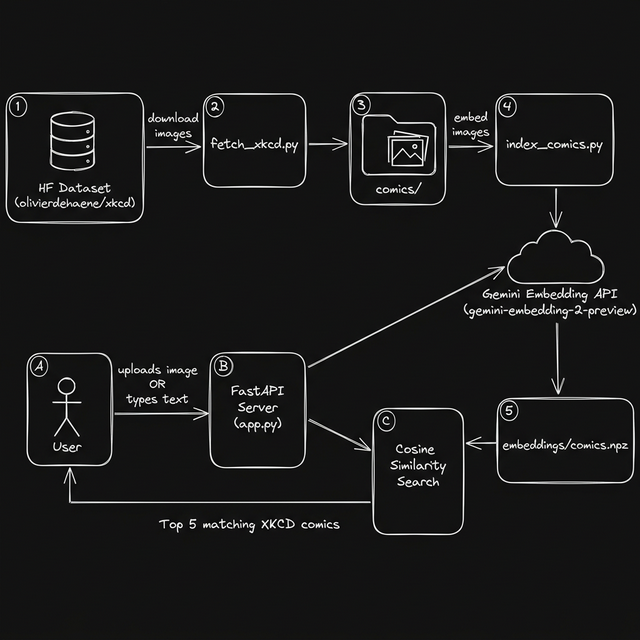

# XKCD Reverse Lookup 
> Upload an XKCD comic image or describe it in text — instantly find which comic it is.

Powered by **TypeSafe AI System One (Jev)** for ultra-fast semantic search with calibrated probabilities, **gemini-embedding-2-preview** multimodal embeddings, **ChromaDB** for vector storage, and the [olivierdehaene/xkcd](https://huggingface.co/datasets/olivierdehaene/xkcd) dataset.



## Setup

```bash
# Install dependencies
pip install -r requirements.txt

# Set your API keys (Gemini and/or TypeSafe)
cp .env.example .env
# edit .env with your keys:
# TYPESAFE_API_KEY=your_typesafe_key
# GEMINI_API_KEY=your_gemini_key

# Fetch comics from HF dataset (default: last 50)
python fetch_xkcd.py 50

# Optional: Build the Gemini embedding index (only needed for Gemini/Chroma vector search)
python index_comics.py

# Optional: Benchmark TypeSafe speed and throughput
python benchmark_speed.py

# Start the server
python app.py
```

Open [http://localhost:8000](http://localhost:8000) and search!

## Search Engines

1. **TypeSafe AI (Jev System One)** — Evaluates candidate comics in a single round-trip (~100–150ms). Returns calibrated probability distributions, confidence levels, and an existence check (`has_match` Noul). Requires zero vector pre-indexing.
2. **Gemini + ChromaDB** — Embeds text or uploaded images using `gemini-embedding-2-preview` into ChromaDB for cosine similarity matching.
3. **Hybrid Re-ranking** — Uses ChromaDB vector search to retrieve candidate shortlists, then applies TypeSafe System One (Jev) to re-rank the shortlist with calibrated decision probabilities.

## Speed Benchmark

To benchmark TypeSafe AI latency and concurrency:

```bash
python benchmark_speed.py
```

Or test it live right in the browser using the **Benchmark Speed** button in the web UI.

